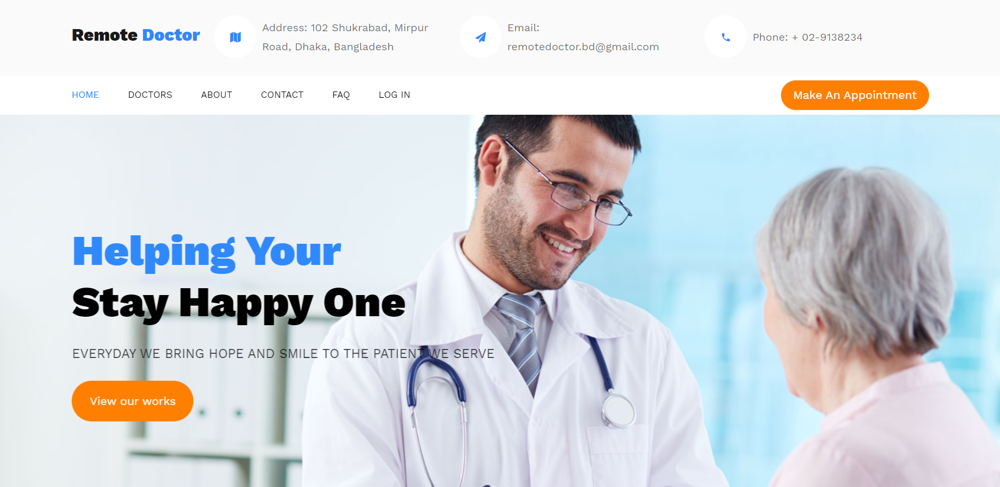

# Remote-Doctor

   
  
  
  
  

## Objectives
The object of telemedicine software is to make it as easy as possible for patients to get the care they need from anywhere. That’s why it is important to provide the ability to use a browser. Patients can connect in the way that is easiest for them, wherever they are. They can seek medical attention from their disease respective doctors. 👨‍⚕️💬💊🩺🗓🎬🙍‍♂️

Check out the [Project Report](https://www.slideshare.net/RaihanMahmud5/remote-doctor-project-report) to learn more about this Project.

## Technologies

- Front end: HTML, CSS, Bootstrap, Font awesome, JavaScript, Ajax
- Back end: [.Net MVC with C#] Framework version 5 and Node.js
- ORM: Entity Framework (Code First)

## About the Author

### Raihan Mahmud

- Facebook Page - [Raihan Mahmud RAM](https://www.facebook.com/raihanmahmudofficial)
- Facebook - [Raihan Mahmud RAM](https://www.facebook.com/raihanM95)
- Twitter - [Raihan Mahmud RAM](https://twitter.com/raihanM95)
- Linkedin - [Raihan Mahmud RAM](https://www.linkedin.com/in/raihanM95)

## Licensing

raihanM95/Remote-Doctor Project is licensed with the [Apache License](https://github.com/raihanM95/Remote-Doctor/blob/master/LICENSE).
